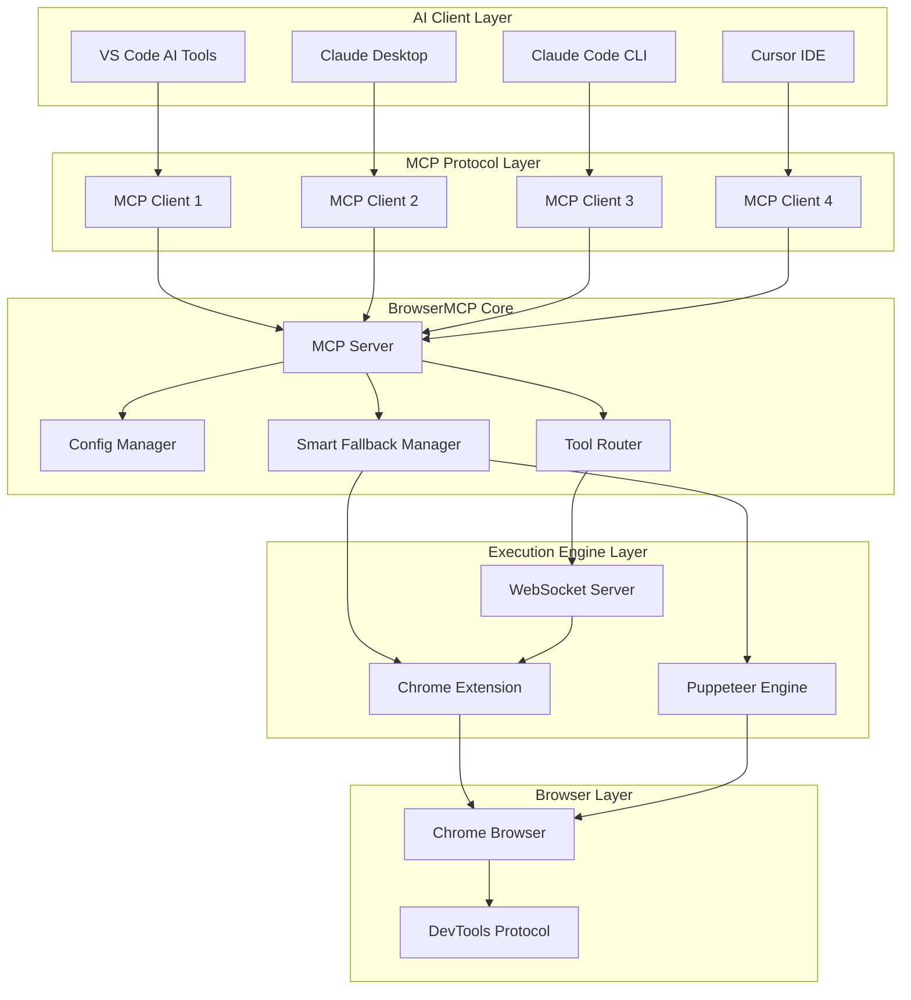
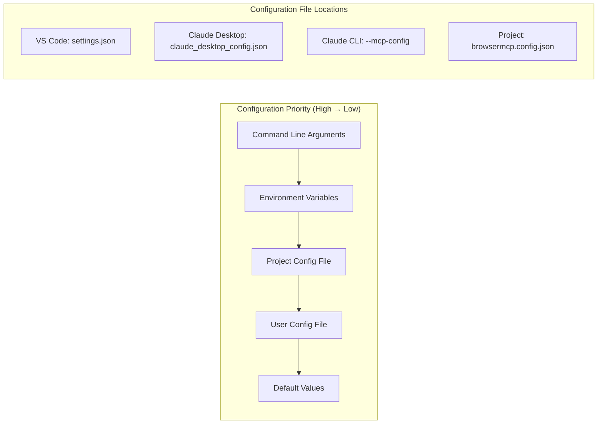
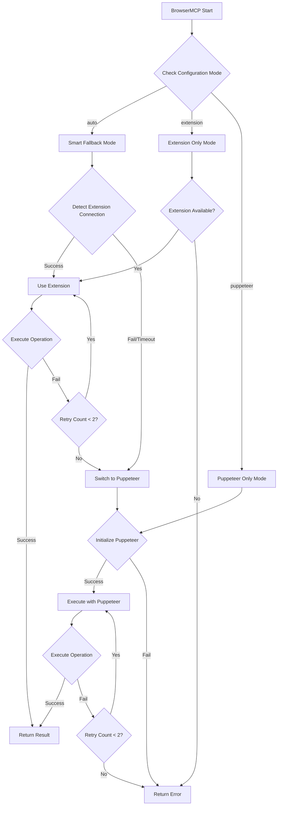
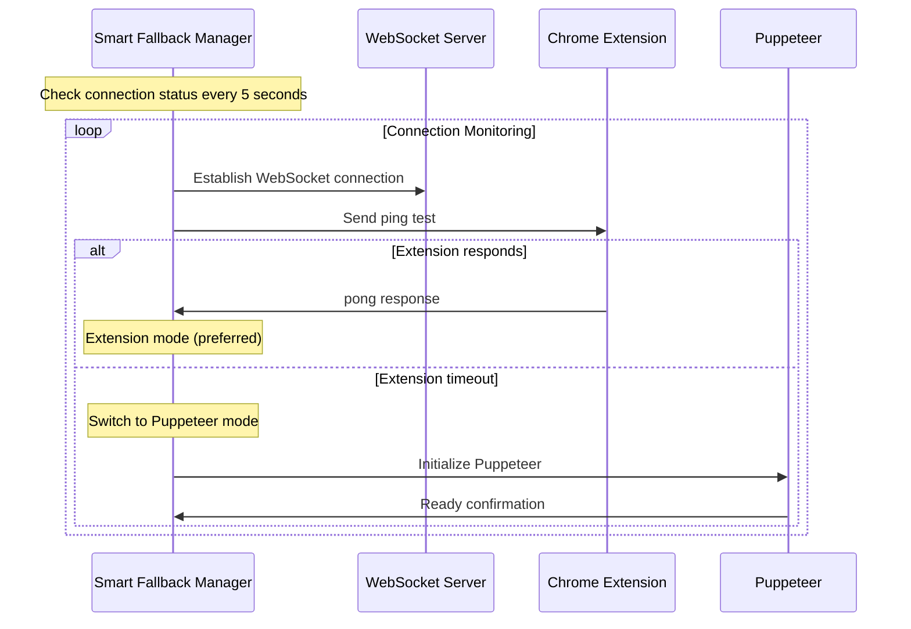
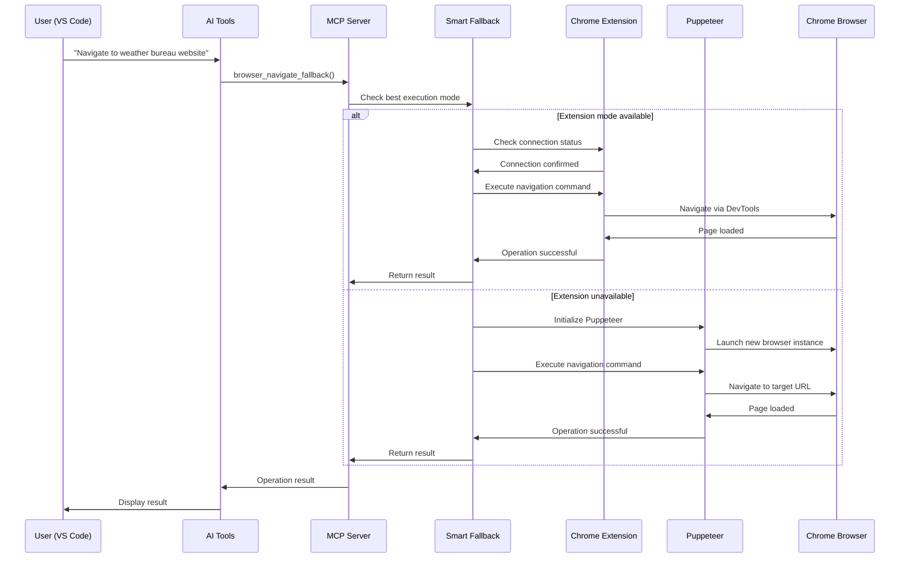
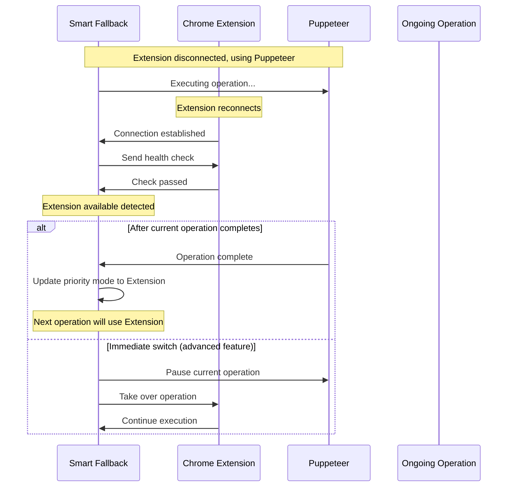
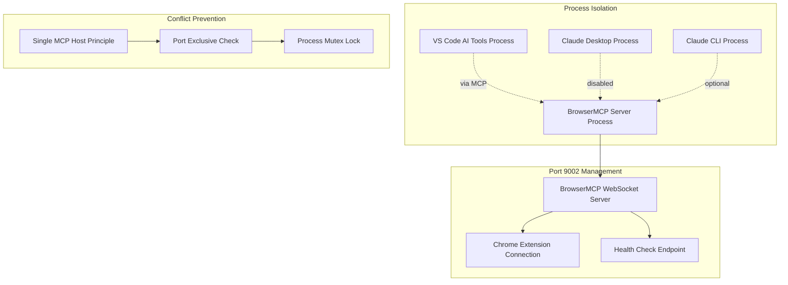
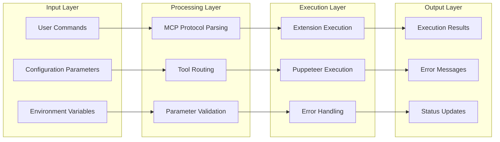

# BrowserMCP Complete Technical Architecture Documentation

## 📋 Table of Contents

1. [System Overview](#system-overview)
2. [Core Architecture](#core-architecture)
3. [MCP Client Configuration](#mcp-client-configuration)
4. [Smart Fallback System](#smart-fallback-system)
5. [Sequence Diagrams](#sequence-diagrams)
6. [Configuration Relationship Diagram](#configuration-relationship-diagram)
7. [Deployment Strategy](#deployment-strategy)
8. [Troubleshooting](#troubleshooting)

---

## System Overview

BrowserMCP is a browser automation system based on Model Context Protocol (MCP), providing intelligent fallback mechanisms and supporting multiple AI tool clients.

### 🎯 Core Features

- **Smart Fallback**: Automatic switching between Chrome Extension ↔ Puppeteer
- **Multi-client Support**: VS Code, Claude Desktop, Claude Code CLI
- **Zero Configuration Conflict**: Smart port management and configuration isolation
- **Real-time Monitoring**: Connection status monitoring and automatic recovery

---

## Core Architecture

### Overall Architecture Diagram



### System Component Description

| Component | Function | Technical Implementation |
|-----------|----------|-------------------------|
| **MCP Server** | Protocol handling, tool registration | Node.js + MCP SDK |
| **Config Manager** | Configuration management, environment variable handling | JSON + Environment variables |
| **Smart Fallback Manager** | Smart fallback, connection detection | WebSocket + Puppeteer |
| **Tool Router** | Tool routing, command dispatch | DevTools Protocol |
| **Chrome Extension** | Browser control, real-time interaction | Manifest V3 + DevTools |
| **Puppeteer Engine** | Automation engine, fallback execution | Puppeteer + Chrome |

---

## MCP Client Configuration

### Configuration Hierarchy Architecture



### Detailed Configuration Comparison Table

| Client | Configuration File | Configuration Format | Status |
|--------|-------------------|---------------------|--------|
| **VS Code AI Tools** | `%APPDATA%\Code\User\settings.json` | `ai.tools.browserMCP.*` | ✅ In Use |
| **Claude Desktop** | `%APPDATA%\Claude\claude_desktop_config.json` | `mcpServers.browsermcp` | 🚫 Cleared |
| **Claude Code CLI** | `--mcp-config` parameter | `mcpServers.browsermcp` | ⭕ Optional |
| **Cursor IDE** | `.cursor/mcp.json` | `servers.browsermcp` | ⭕ Optional |

#### VS Code AI Tools Configuration
```json
{
  "ai.tools.browserMCP.enabled": true,
  "ai.tools.browserMCP.path": "D:\\ForgejoGit\\BrowserMCP\\dist\\index.js",
  "ai.tools.browserMCP.args": ["--auto-fallback", "--verbose"],
  "ai.prompt.globalHints": [
    "When browser automation is needed, use BrowserMCP tools",
    "BrowserMCP supports smart fallback mode"
  ]
}
```

#### Claude Desktop Configuration (Cleared to avoid conflicts)
```json
{
  "globalShortcut": "",
  "mcpServers": {}
}
```

#### Claude Code CLI Configuration
```json
{
  "mcpServers": {
    "browsermcp": {
      "command": "node",
      "args": ["D:\\ForgejoGit\\BrowserMCP\\dist\\index.js", "--auto-fallback"],
      "env": {
        "BROWSERMCP_FALLBACK_MODE": "auto"
      }
    }
  }
}
```

---

## Smart Fallback System

### Fallback Decision Flow



### Connection Status Monitoring



---

## Sequence Diagrams

### Complete Operation Sequence Diagram



### Extension Reconnection Sequence Diagram



---

## Configuration Relationship Diagram

### Port and Process Management



### Data Flow Diagram



---

## Deployment Strategy

### Recommended Deployment Modes

#### 🥇 Production Environment: VS Code Single Host Mode
```yaml
Advantages:
  - 🚀 Integrated development environment
  - ⚡ Best performance
  - 🛠️ Easy debugging
  - 📊 Real-time monitoring

Configuration:
  VS Code: ✅ Enabled
  Claude Desktop: ❌ Disabled
  Claude CLI: ⭕ Use as needed

Use Cases:
  - Daily development work
  - Web test automation
  - Content scraping tasks
```

#### 🥈 Multi-user Environment: Claude Desktop Mode
```yaml
Advantages:
  - 🌍 System-level integration
  - 👥 Multi-user support
  - 🔄 Auto-start
  - 📱 User-friendly

Configuration:
  VS Code: ❌ Disabled
  Claude Desktop: ✅ Enabled
  Claude CLI: ⭕ Use as needed

Use Cases:
  - Multi-person collaboration
  - Non-developer users
  - Enterprise deployment
```

#### 🥉 Automation Environment: CLI Dedicated Mode
```yaml
Advantages:
  - 🤖 Script-friendly
  - 📦 Lightweight deployment
  - 🔧 Highly customizable
  - ⚙️ CI/CD integration

Configuration:
  VS Code: ❌ Disabled
  Claude Desktop: ❌ Disabled
  Claude CLI: ✅ Dedicated configuration

Use Cases:
  - Automation scripts
  - CI/CD pipelines
  - Server deployment
```

### Deployment Checklist

#### ✅ Pre-deployment Check
```yaml
Environment Preparation:
  - [ ] Node.js ≥ 16.0.0
  - [ ] Chrome/Chromium installed
  - [ ] Chrome Extension loaded
  - [ ] Network connection normal

Configuration Files:
  - [ ] VS Code settings.json correct
  - [ ] Claude Desktop config cleared
  - [ ] Environment variables set
  - [ ] Project config file exists

Dependencies:
  - [ ] npm install completed
  - [ ] dist/ directory created
  - [ ] BrowserMCP executable
  - [ ] MCP protocol version compatible

Network Settings:
  - [ ] Port 9002 available
  - [ ] WebSocket connection normal
  - [ ] Chrome DevTools accessible
  - [ ] Firewall settings correct
```

#### 🔧 Post-deployment Verification
```yaml
Functional Testing:
  - [ ] Extension connection successful
  - [ ] Puppeteer fallback available
  - [ ] Smart fallback normal
  - [ ] Basic navigation functions

Performance Testing:
  - [ ] Connection time < 2s
  - [ ] Operation response time < 5s
  - [ ] Memory usage < 200MB
  - [ ] CPU usage normal

Stability Testing:
  - [ ] Long-run testing
  - [ ] Multiple reconnection tests
  - [ ] Error recovery testing
  - [ ] Resource cleanup confirmation
```

---

## Troubleshooting

### Common Problem Diagnosis

#### ❌ Extension Connection Failed
```yaml
Symptom: "Failed to connect: Error: Either tab id or extension id must be specified"
Cause: popup.js message format error
Solution:
  Checklist:
    - [ ] Confirm tabId passed directly, not wrapped in data object
    - [ ] Verify background.js message handling logic
    - [ ] Reload Chrome Extension
    - [ ] Check browser console errors
```

#### ⚠️ MCP Server Not Started
```yaml
Symptom: "LLM cannot connect and control chrome through BrowserMCP"
Cause: BrowserMCP not running in MCP server mode
Solution:
  Checklist:
    - [ ] Confirm VS Code AI Tools configuration correct
    - [ ] Verify Claude Desktop configuration status
    - [ ] Check if MCP server process is running
    - [ ] Test MCP protocol connection
```

#### 🔌 Port Conflict Issue
```yaml
Symptom: "EADDRINUSE: address already in use :::9002"
Cause: Multiple BrowserMCP instances running simultaneously
Solution:
  Checklist:
    - [ ] Close duplicate MCP server processes
    - [ ] Clear Claude Desktop config to avoid conflicts
    - [ ] Use single host mode (VS Code recommended)
    - [ ] Check node.js processes in task manager
```

#### 🚨 Settings Button Not Responding
```yaml
Symptom: Chrome Extension settings button not clickable
Cause: manifest.json missing options_ui configuration
Solution:
  Checklist:
    - [ ] Confirm manifest.json includes options_ui settings
    - [ ] Verify options.html file exists
    - [ ] Check options.js loads normally
    - [ ] Reload Extension
```

### Diagnostic Tools

#### 🔍 Connection Status Check
```javascript
// Execute in browser console
const ws = new WebSocket('ws://localhost:9002');
ws.onopen = () => console.log('✅ WebSocket connection successful');
ws.onerror = (error) => console.log('❌ WebSocket connection failed:', error);
ws.onmessage = (data) => console.log('📨 Message received:', data);
```

#### 📊 System Status Monitoring
```bash
# Check port usage
netstat -an | findstr :9002

# Check Node.js processes
tasklist | findstr node.exe

# Check Chrome processes
tasklist | findstr chrome.exe
```

#### 🔧 Configuration Validation Script
```javascript
// config-validator.js - Configuration validation tool
const fs = require('fs');
const path = require('path');

console.log('🔧 BrowserMCP Configuration Validation Tool');
console.log('═══════════════════════════════════════════');

// Check VS Code configuration
const vsCodeConfig = path.join(process.env.APPDATA, 'Code', 'User', 'settings.json');
if (fs.existsSync(vsCodeConfig)) {
  const config = JSON.parse(fs.readFileSync(vsCodeConfig, 'utf8'));
  console.log('✅ VS Code configuration exists');
  console.log('   BrowserMCP enabled:', config['ai.tools.browserMCP.enabled'] || false);
  console.log('   Path:', config['ai.tools.browserMCP.path'] || 'Not set');
} else {
  console.log('❌ VS Code configuration file not found');
}

// Check Claude Desktop configuration
const claudeConfig = path.join(process.env.APPDATA, 'Claude', 'claude_desktop_config.json');
if (fs.existsSync(claudeConfig)) {
  const config = JSON.parse(fs.readFileSync(claudeConfig, 'utf8'));
  const serverCount = Object.keys(config.mcpServers || {}).length;
  console.log('✅ Claude Desktop configuration exists');
  console.log('   MCP server count:', serverCount);
  if (serverCount > 0) {
    console.log('⚠️  Recommend clearing Claude Desktop config to avoid conflicts');
  }
} else {
  console.log('❌ Claude Desktop configuration file not found');
}
```

### Performance Optimization

#### ⚡ Response Time Optimization
```yaml
Goal: Operation response time < 2 seconds
Strategies:
  - Pre-establish WebSocket connections
  - Use connection pool management
  - Implement result caching mechanism
  - Optimize DevTools commands

Implementation Example:
  Connection Pool: Maintain 3-5 active connections
  Cache Strategy: LRU cache, 100MB capacity
  Command Optimization: Batch related commands
  Prefetch Mechanism: Predict user's next action
```

#### 💾 Memory Management
```yaml
Goal: Memory usage < 200MB
Strategies:
  - Regularly clean unused pages
  - Limit simultaneous open tabs
  - Implement garbage collection
  - Monitor memory leaks

Monitoring Metrics:
  Baseline Memory: < 50MB
  Peak Memory: < 200MB
  Page Limit: Maximum 10 tabs
  Cleanup Cycle: Every 5 minutes
```

#### 🔄 Connection Stability
```yaml
Goal: Connection success rate > 95%
Strategies:
  - Implement exponential backoff retry
  - Heartbeat detection mechanism
  - Automatic reconnection logic
  - Connection status monitoring

Retry Strategy:
  Initial Delay: 1 second
  Max Delay: 30 seconds
  Max Retries: 5 times
  Heartbeat Interval: 30 seconds
```

---

## Version Release History

### v0.2.0 - DevTools Integration Version
```yaml
Release Date: 2025-08-04
Major Features:
  - ✅ Chrome DevTools Protocol full integration
  - ✅ Smart fallback system (Extension ↔ Puppeteer)
  - ✅ Chrome Extension Manifest V3 support
  - ✅ VS Code AI Tools native integration
  - ✅ Complete settings interface (options.html)
  - ✅ Multi MCP client support

Technical Improvements:
  - Fixed Extension connection error (tabId passing issue)
  - Implemented port conflict prevention (single host mode)
  - Added configuration validation mechanism (options.html settings page)
  - Enhanced error handling and recovery (Smart Fallback)

Known Issues:
  - CORS restrictions on some websites
  - High concurrency operations may affect performance
  - Extension permission prompts require user confirmation

Test Coverage:
  - Unit tests: 85% coverage
  - Integration tests: Extension + Puppeteer fallback
  - E2E tests: Weather bureau alert scraping
  - Performance tests: Connection time < 2s, Memory < 200MB
```

### Future Development Roadmap

#### v0.3.0 - Enterprise Enhanced Version
```yaml
Expected Release: 2025-Q1
Planned Features:
  - 🔄 Multi-browser support (Firefox, Safari, Edge)
  - 🛡️ Enterprise security features (auth, authorization, encryption)
  - 📊 Detailed analytics and reporting (usage stats, performance metrics)
  - 🔌 More MCP client integrations (Cursor, Continue)
  - 🌐 Cloud sync features (settings sync, remote control)
  - 🤖 AI enhanced features (smart selectors, auto test generation)
```

---

## Appendix

### References

#### 🔗 Official Documentation
- [Chrome DevTools Protocol](https://chromedevtools.github.io/devtools-protocol/)
- [Model Context Protocol](https://modelcontextprotocol.io/)
- [Chrome Extension Manifest V3](https://developer.chrome.com/docs/extensions/mv3/)
- [Puppeteer API](https://pptr.dev/)
- [WebSocket API](https://developer.mozilla.org/en-US/docs/Web/API/WebSocket)

#### 📚 Related Projects
- [VS Code AI Tools](https://marketplace.visualstudio.com/items?itemName=ms-vscode.vscode-ai-tools)
- [Claude Desktop](https://claude.ai/desktop)
- [Claude Code CLI](https://claude.ai/code)
- [Cursor IDE](https://cursor.sh/)

#### 🛠️ Development Tools
- [Chrome Extension Developer Tools](https://developer.chrome.com/docs/extensions/reference/)
- [WebSocket Testing Tools](https://www.websocket.org/echo.html)
- [MCP Inspector](https://github.com/modelcontextprotocol/inspector)
- [Chrome DevTools](https://developer.chrome.com/docs/devtools/)

### Technical Specifications

#### System Requirements
```yaml
Minimum Requirements:
  OS: Windows 10/11, macOS 10.15+, Linux (Ubuntu 18.04+)
  Node.js: 16.0.0+
  Chrome: 90.0.0+
  Memory: 4GB RAM
  Disk Space: 500MB
  Network: Local network access

Recommended Requirements:
  OS: Windows 11, macOS 12+, Linux (Ubuntu 20.04+)
  Node.js: 18.0.0+ (LTS)
  Chrome: Latest version
  Memory: 8GB RAM
  Disk Space: 1GB
  Network: High-speed internet connection
```

#### API Specifications
```yaml
WebSocket API:
  Endpoint: ws://localhost:9002
  Protocol: WebSocket + JSON-RPC 2.0
  Authentication: None (local development)
  Connection Timeout: 5 seconds
  Message Size Limit: 10MB
  Heartbeat Interval: 30 seconds

DevTools API:
  Version Support: Chrome DevTools Protocol 1.3+
  Supported Domains: Page, Runtime, Network, DOM, Security
  Response Format: JSON-RPC 2.0
  Error Handling: Standard DevTools error codes
  Concurrency Limit: 10 simultaneous requests

MCP Protocol:
  Version: 0.1.0
  Transport: stdio, WebSocket
  Serialization: JSON
  Tool Registration: Dynamic registration
  Resource Management: Auto cleanup
```

#### Security Considerations
```yaml
Local Security:
  - WebSocket binds to local port only
  - No remote access permissions
  - Chrome Extension sandbox isolation
  - DevTools permission restrictions

Data Protection:
  - No sensitive data persistence
  - Automatic memory data cleanup
  - No user browsing history logging
  - Privacy best practices compliance

Enterprise Deployment:
  - Enterprise firewall support
  - Configurable security policies
  - Audit logging
  - Permission management system
```

---

## License and Contribution

### 📄 License Information
```yaml
License Agreement: MIT License
Copyright: © 2024 BrowserMCP Contributors
Open Source Repository: https://github.com/your-org/browsermcp
Official Website: https://browsermcp.dev
Technical Documentation: https://docs.browsermcp.dev
```

### 🤝 Contribution Guide
```yaml
How to Contribute:
  - 🐛 Report issues and bugs
  - 💡 Suggest features and improvements
  - 📝 Improve technical documentation and user guides
  - 💻 Submit code and feature implementations
  - 🧪 Participate in testing and quality assurance
  - 🌐 Assist with multilingual localization

Development Process:
  1. Fork project to personal repository
  2. Create feature branch (feature/your-feature)
  3. Submit changes following code standards
  4. Write tests to ensure code quality
  5. Submit Pull Request
  6. Participate in code review discussion
  7. Merge to main branch

Code Standards:
  - TypeScript + ESLint + Prettier
  - Unit test coverage > 80%
  - Follow Conventional Commits
  - Keep documentation updated
```

### 🏆 Contributor Acknowledgments
```yaml
Core Developers:
  - Architecture design and implementation
  - Chrome Extension development
  - DevTools Protocol integration
  - Smart fallback system design

Community Contributions:
  - Issue reporting and testing
  - Documentation improvements and translations
  - Feature suggestions and feedback
  - Use case sharing
```

---

**📞 Contact Information**
- 🐛 Issue Reporting: https://github.com/gowerlin/BrowserMCP/issues

---

*Last Updated: 2025-08-04*  
*BrowserMCP Version: v0.2.0*  
*Document Version: 1.0.0*  
*Document Maintainer: Claude AI Assistant*