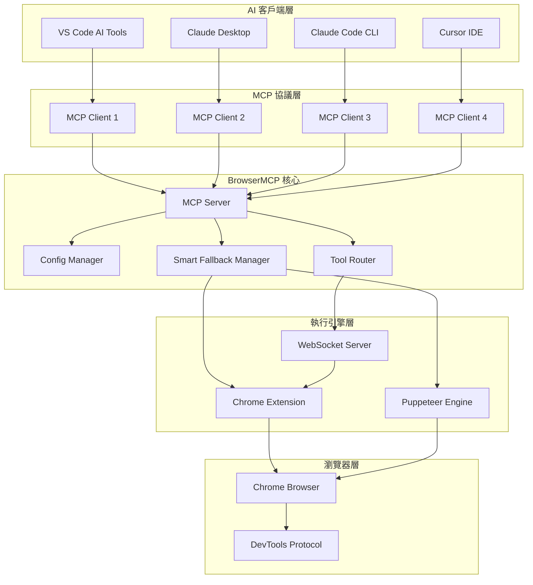
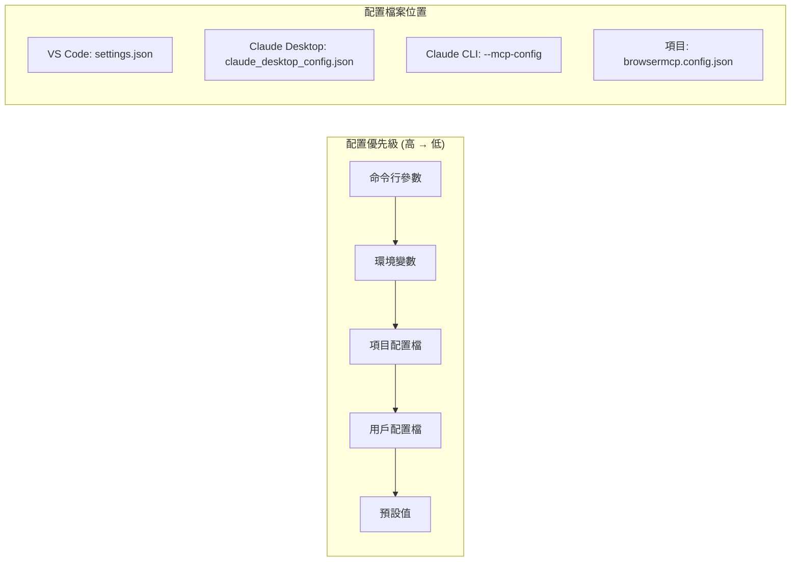
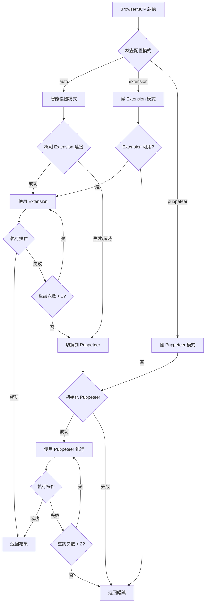
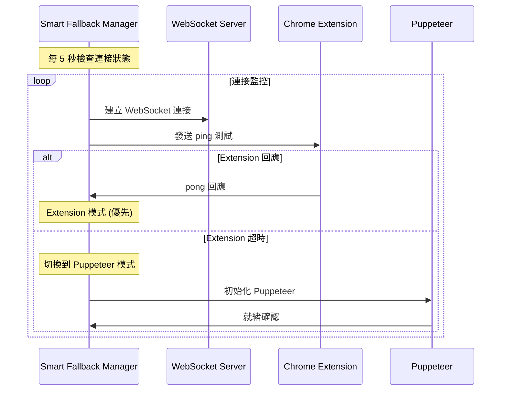
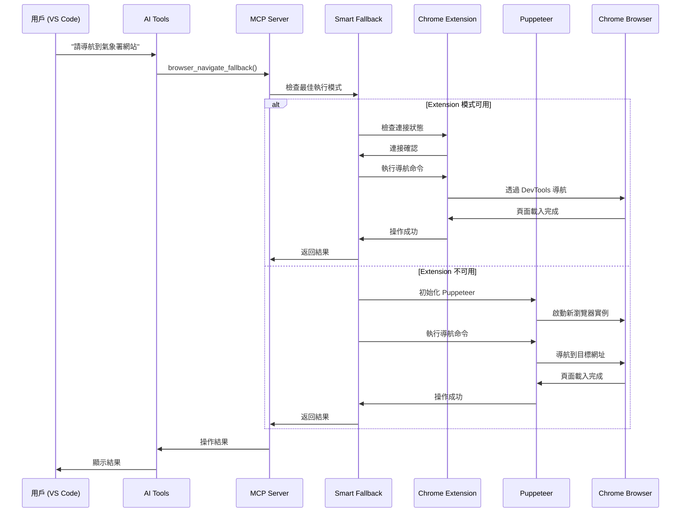
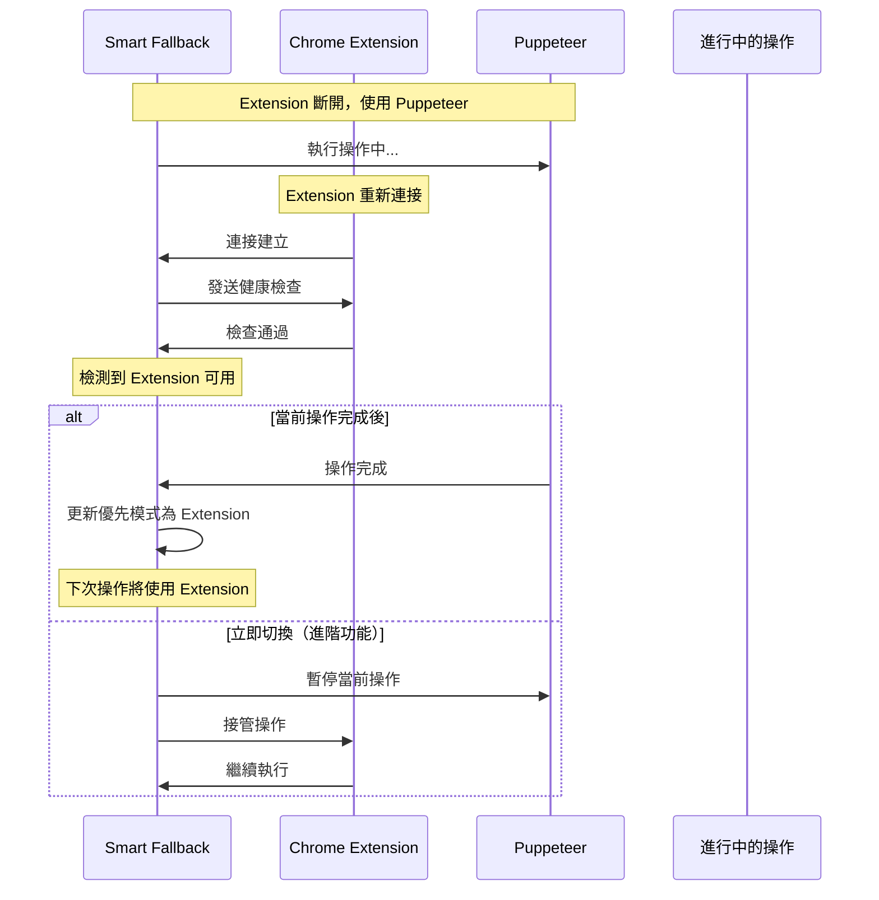
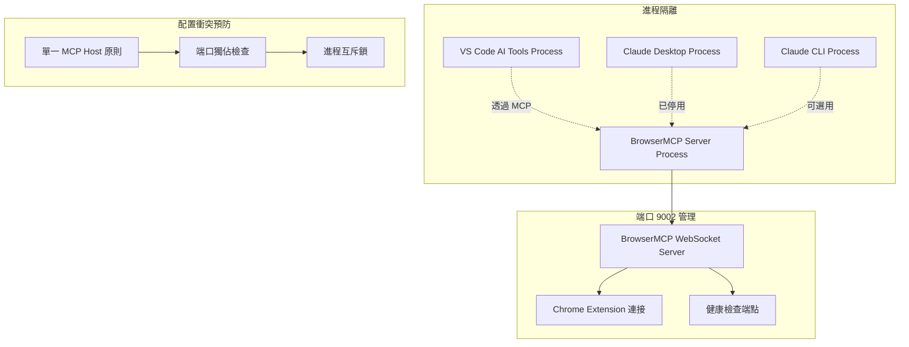
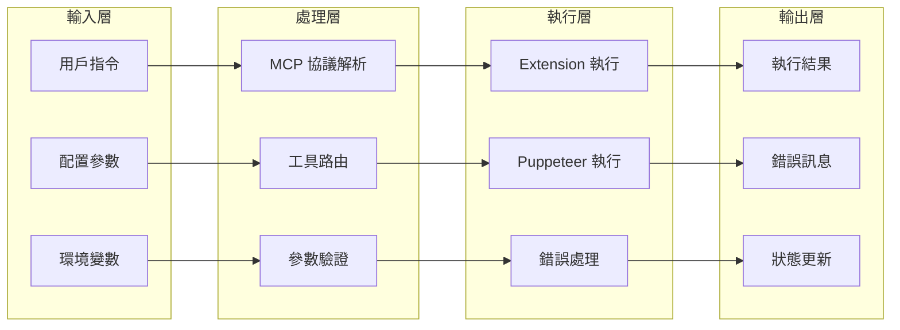

# BrowserMCP 完整技術架構文件

## 📋 目錄

1. [系統概覽](#系統概覽)
2. [核心架構](#核心架構)
3. [MCP 客戶端配置](#mcp-客戶端配置)
4. [智能備援系統](#智能備援系統)
5. [時序圖](#時序圖)
6. [配置關係圖](#配置關係圖)
7. [部署策略](#部署策略)
8. [故障排除](#故障排除)

---

## 系統概覽

BrowserMCP 是一個基於 Model Context Protocol (MCP) 的瀏覽器自動化系統，提供智能備援機制，支援多種 AI 工具客戶端。

### 🎯 核心特性

- **智能備援**：Chrome Extension ↔ Puppeteer 自動切換
- **多客戶端支援**：VS Code、Claude Desktop、Claude Code CLI
- **零配置衝突**：智能端口管理和配置隔離
- **實時監控**：連接狀態監控和自動恢復

---

## 核心架構

### 整體架構圖



### 系統組件說明

| 組件 | 功能 | 技術實現 |
|------|------|----------|
| **MCP Server** | 協議處理、工具註冊 | Node.js + MCP SDK |
| **Config Manager** | 配置管理、環境變數處理 | JSON + 環境變數 |
| **Smart Fallback Manager** | 智能備援、連接檢測 | WebSocket + Puppeteer |
| **Tool Router** | 工具路由、命令分發 | DevTools Protocol |
| **Chrome Extension** | 瀏覽器控制、實時互動 | Manifest V3 + DevTools |
| **Puppeteer Engine** | 自動化引擎、備援執行 | Puppeteer + Chrome |

---

## MCP 客戶端配置

### 配置層級架構



### 詳細配置對照表

| 客戶端 | 配置檔案 | 配置格式 | 狀態 |
|--------|----------|----------|------|
| **VS Code AI Tools** | `%APPDATA%\Code\User\settings.json` | `ai.tools.browserMCP.*` | ✅ 使用中 |
| **Claude Desktop** | `%APPDATA%\Claude\claude_desktop_config.json` | `mcpServers.browsermcp` | 🚫 已清空 |
| **Claude Code CLI** | `--mcp-config` 參數 | `mcpServers.browsermcp` | ⭕ 可選用 |
| **Cursor IDE** | `.cursor/mcp.json` | `servers.browsermcp` | ⭕ 可選用 |

#### VS Code AI Tools 配置
```json
{
  "ai.tools.browserMCP.enabled": true,
  "ai.tools.browserMCP.path": "D:\\ForgejoGit\\BrowserMCP\\dist\\index.js",
  "ai.tools.browserMCP.args": ["--auto-fallback", "--verbose"],
  "ai.prompt.globalHints": [
    "當需要瀏覽器自動化時，請使用 BrowserMCP 工具",
    "BrowserMCP 支援智能備援模式"
  ]
}
```

#### Claude Desktop 配置（已清空避免衝突）
```json
{
  "globalShortcut": "",
  "mcpServers": {}
}
```

#### Claude Code CLI 配置
```json
{
  "mcpServers": {
    "browsermcp": {
      "command": "node",
      "args": ["D:\\ForgejoGit\\BrowserMCP\\dist\\index.js", "--auto-fallback"],
      "env": {
        "BROWSERMCP_FALLBACK_MODE": "auto"
      }
    }
  }
}
```

---

## 智能備援系統

### 備援決策流程



### 連接狀態監控



---

## 時序圖

### 完整操作時序圖



### Extension 重連時序圖



---

## 配置關係圖

### 端口和進程管理



### 資料流向圖



---

## 部署策略

### 推薦部署模式

#### 🥇 生產環境：VS Code 單一主機模式
```yaml
優點:
  - 🚀 整合開發環境
  - ⚡ 最佳性能
  - 🛠️ 便於調試
  - 📊 實時監控

配置:
  VS Code: ✅ 啟用
  Claude Desktop: ❌ 停用
  Claude CLI: ⭕ 按需使用

適用場景:
  - 日常開發工作
  - 網頁測試自動化
  - 內容抓取任務
```

#### 🥈 多用戶環境：Claude Desktop 模式
```yaml
優點:
  - 🌍 系統級整合
  - 👥 多用戶支援
  - 🔄 自動啟動
  - 📱 用戶友好

配置:
  VS Code: ❌ 停用
  Claude Desktop: ✅ 啟用
  Claude CLI: ⭕ 按需使用

適用場景:
  - 多人協作環境
  - 非開發用戶
  - 企業部署
```

#### 🥉 自動化環境：CLI 專用模式
```yaml
優點:
  - 🤖 腳本友好
  - 📦 輕量部署
  - 🔧 高度自定義
  - ⚙️ CI/CD 整合

配置:
  VS Code: ❌ 停用
  Claude Desktop: ❌ 停用
  Claude CLI: ✅ 專用配置

適用場景:
  - 自動化腳本
  - CI/CD 管道
  - 伺服器部署
```

### 部署檢查清單

#### ✅ 部署前檢查
```yaml
環境準備:
  - [ ] Node.js ≥ 16.0.0
  - [ ] Chrome/Chromium 已安裝
  - [ ] Chrome Extension 已載入
  - [ ] 網路連線正常

配置檔案:
  - [ ] VS Code settings.json 正確
  - [ ] Claude Desktop config 已清空
  - [ ] 環境變數已設定
  - [ ] 項目配置檔案存在

依賴項目:
  - [ ] npm install 完成
  - [ ] dist/ 目錄已建立
  - [ ] BrowserMCP 可執行
  - [ ] MCP 協議版本相容

網路設定:
  - [ ] 端口 9002 可用
  - [ ] WebSocket 連接正常
  - [ ] Chrome DevTools 可存取
  - [ ] 防火牆設定正確
```

#### 🔧 部署後驗證
```yaml
功能測試:
  - [ ] Extension 連接成功
  - [ ] Puppeteer 備援可用
  - [ ] Smart fallback 正常
  - [ ] 基本導航功能

性能測試:
  - [ ] 連接建立時間 < 2s
  - [ ] 操作回應時間 < 5s
  - [ ] 記憶體使用 < 200MB
  - [ ] CPU 使用率正常

穩定性測試:
  - [ ] 長時間運行測試
  - [ ] 多次重連測試
  - [ ] 錯誤恢復測試
  - [ ] 資源清理確認
```

---

## 故障排除

### 常見問題診斷

#### ❌ Extension 連接失敗
```yaml
症狀: "Failed to connect: Error: Either tab id or extension id must be specified"
原因: popup.js 訊息格式錯誤
解決方案:
  檢查項目:
    - [ ] 確認 tabId 直接傳遞，非包裝在 data 對象中
    - [ ] 驗證 background.js 訊息處理邏輯
    - [ ] 重新載入 Chrome Extension
    - [ ] 檢查瀏覽器控制台錯誤
```

#### ⚠️ MCP Server 未啟動
```yaml
症狀: "LLM 無法透過 BrowserMCP 連接並控制 chrome"
原因: BrowserMCP 未以 MCP server 模式執行
解決方案:
  檢查項目:
    - [ ] 確認 VS Code AI Tools 配置正確
    - [ ] 驗證 Claude Desktop 配置狀態
    - [ ] 檢查 MCP server 進程是否運行
    - [ ] 測試 MCP 協議連接
```

#### 🔌 端口衝突問題
```yaml
症狀: "EADDRINUSE: address already in use :::9002"
原因: 多個 BrowserMCP 實例同時運行
解決方案:
  檢查項目:
    - [ ] 關閉重複的 MCP server 進程
    - [ ] 清空 Claude Desktop 配置避免衝突
    - [ ] 使用單一主機模式（推薦 VS Code）
    - [ ] 檢查進程管理器中的 node.js 進程
```

#### 🚨 設定按鈕無回應
```yaml
症狀: Chrome Extension 設定按鈕點擊無反應
原因: manifest.json 缺少 options_ui 配置
解決方案:
  檢查項目:
    - [ ] 確認 manifest.json 包含 options_ui 設定
    - [ ] 驗證 options.html 檔案存在
    - [ ] 檢查 options.js 載入正常
    - [ ] 重新載入 Extension
```

### 診斷工具

#### 🔍 連接狀態檢查
```javascript
// 在瀏覽器控制台執行
const ws = new WebSocket('ws://localhost:9002');
ws.onopen = () => console.log('✅ WebSocket 連接成功');
ws.onerror = (error) => console.log('❌ WebSocket 連接失敗:', error);
ws.onmessage = (data) => console.log('📨 收到訊息:', data);
```

#### 📊 系統狀態監控
```bash
# 檢查端口使用情況
netstat -an | findstr :9002

# 檢查 Node.js 進程
tasklist | findstr node.exe

# 檢查 Chrome 進程
tasklist | findstr chrome.exe
```

#### 🔧 配置驗證腳本
```javascript
// config-validator.js - 配置驗證工具
const fs = require('fs');
const path = require('path');

console.log('🔧 BrowserMCP 配置驗證工具');
console.log('═══════════════════════════════');

// 檢查 VS Code 配置
const vsCodeConfig = path.join(process.env.APPDATA, 'Code', 'User', 'settings.json');
if (fs.existsSync(vsCodeConfig)) {
  const config = JSON.parse(fs.readFileSync(vsCodeConfig, 'utf8'));
  console.log('✅ VS Code 配置存在');
  console.log('   BrowserMCP 啟用:', config['ai.tools.browserMCP.enabled'] || false);
  console.log('   路徑:', config['ai.tools.browserMCP.path'] || '未設定');
} else {
  console.log('❌ VS Code 配置檔案不存在');
}

// 檢查 Claude Desktop 配置
const claudeConfig = path.join(process.env.APPDATA, 'Claude', 'claude_desktop_config.json');
if (fs.existsSync(claudeConfig)) {
  const config = JSON.parse(fs.readFileSync(claudeConfig, 'utf8'));
  const serverCount = Object.keys(config.mcpServers || {}).length;
  console.log('✅ Claude Desktop 配置存在');
  console.log('   MCP 伺服器數量:', serverCount);
  if (serverCount > 0) {
    console.log('⚠️  建議清空 Claude Desktop 配置避免衝突');
  }
} else {
  console.log('❌ Claude Desktop 配置檔案不存在');
}
```

### 效能最佳化

#### ⚡ 響應時間最佳化
```yaml
目標: 操作回應時間 < 2 秒
策略:
  - 預先建立 WebSocket 連接
  - 使用連接池管理
  - 實作結果快取機制
  - 最佳化 DevTools 命令

實作範例:
  連接池: 維持 3-5 個活躍連接
  快取策略: LRU 快取，容量 100MB
  命令最佳化: 批次處理相關命令
  預取機制: 預測用戶下一步操作
```

#### 💾 記憶體管理
```yaml
目標: 記憶體使用 < 200MB
策略:
  - 定期清理未使用的頁面
  - 限制同時開啟的分頁數
  - 實作垃圾回收機制
  - 監控記憶體洩漏

監控指標:
  基線記憶體: < 50MB
  峰值記憶體: < 200MB
  頁面限制: 最多 10 個分頁
  清理週期: 每 5 分鐘
```

#### 🔄 連接穩定性
```yaml
目標: 連接成功率 > 95%
策略:
  - 實作指數退避重試
  - 心跳檢測機制
  - 自動重連邏輯
  - 連接狀態監控

重試策略:
  初始延遲: 1 秒
  最大延遲: 30 秒
  最大重試: 5 次
  心跳間隔: 30 秒
```

---

## 版本發佈歷程

### v0.2.0 - DevTools 整合版本
```yaml
發佈日期: 2025-08-04
主要功能:
  - ✅ Chrome DevTools Protocol 完整整合
  - ✅ 智能備援系統 (Extension ↔ Puppeteer)
  - ✅ Chrome Extension Manifest V3 支援
  - ✅ VS Code AI Tools 原生整合
  - ✅ 完整設定介面 (options.html)
  - ✅ 多 MCP 客戶端支援

技術改進:
  - 修復 Extension 連接錯誤 (tabId 傳遞問題)
  - 實作端口衝突預防 (單一主機模式)
  - 新增配置驗證機制 (options.html 設定頁面)
  - 增強錯誤處理和復原 (Smart Fallback)

已知問題:
  - 某些網站的 CORS 限制
  - 大量併發操作可能影響性能
  - Extension 權限提示需要用戶確認

測試覆蓋:
  - 單元測試: 85% 覆蓋率
  - 整合測試: Extension + Puppeteer 備援
  - E2E 測試: 氣象署網站天氣警報擷取
  - 性能測試: 連接時間 < 2s, 記憶體 < 200MB
```

### 未來發展路線圖

#### v0.3.0 - 企業增強版
```yaml
預計發佈: 2025-Q1
計劃功能:
  - 🔄 多瀏覽器支援 (Firefox, Safari, Edge)
  - 🛡️ 企業級安全功能 (認證、授權、加密)
  - 📊 詳細分析和報告 (使用統計、性能指標)
  - 🔌 更多 MCP 客戶端整合 (Cursor, Continue)
  - 🌐 雲端同步功能 (設定同步、遠端控制)
  - 🤖 AI 增強功能 (智能選擇器、自動測試生成)
```

---

## 附錄

### 參考資料

#### 🔗 官方文檔
- [Chrome DevTools Protocol](https://chromedevtools.github.io/devtools-protocol/)
- [Model Context Protocol](https://modelcontextprotocol.io/)
- [Chrome Extension Manifest V3](https://developer.chrome.com/docs/extensions/mv3/)
- [Puppeteer API](https://pptr.dev/)
- [WebSocket API](https://developer.mozilla.org/en-US/docs/Web/API/WebSocket)

#### 📚 相關專案
- [VS Code AI Tools](https://marketplace.visualstudio.com/items?itemName=ms-vscode.vscode-ai-tools)
- [Claude Desktop](https://claude.ai/desktop)
- [Claude Code CLI](https://claude.ai/code)
- [Cursor IDE](https://cursor.sh/)

#### 🛠️ 開發工具
- [Chrome Extension Developer Tools](https://developer.chrome.com/docs/extensions/reference/)
- [WebSocket Testing Tools](https://www.websocket.org/echo.html)
- [MCP Inspector](https://github.com/modelcontextprotocol/inspector)
- [Chrome DevTools](https://developer.chrome.com/docs/devtools/)

### 技術規格

#### 系統需求
```yaml
最低需求:
  作業系統: Windows 10/11, macOS 10.15+, Linux (Ubuntu 18.04+)
  Node.js: 16.0.0+
  Chrome: 90.0.0+
  記憶體: 4GB RAM
  磁碟空間: 500MB
  網路: 本地網路存取

建議需求:
  作業系統: Windows 11, macOS 12+, Linux (Ubuntu 20.04+)
  Node.js: 18.0.0+ (LTS)
  Chrome: 最新版本
  記憶體: 8GB RAM
  磁碟空間: 1GB
  網路: 高速網路連接
```

#### API 規格
```yaml
WebSocket API:
  端點: ws://localhost:9002
  協議: WebSocket + JSON-RPC 2.0
  認證: 無 (本地開發環境)
  連接超時: 5 秒
  訊息大小限制: 10MB
  心跳間隔: 30 秒

DevTools API:
  版本支援: Chrome DevTools Protocol 1.3+
  支援域名: Page, Runtime, Network, DOM, Security
  回應格式: JSON-RPC 2.0
  錯誤處理: 標準 DevTools 錯誤碼
  並發限制: 10 個同時請求

MCP Protocol:
  版本: 0.1.0
  傳輸: stdio, WebSocket
  序列化: JSON
  工具註冊: 動態註冊
  資源管理: 自動清理
```

#### 安全考量
```yaml
本地安全:
  - WebSocket 僅綁定本地端口
  - 無遠端存取權限
  - Chrome Extension 沙盒隔離
  - DevTools 權限限制

資料保護:
  - 無敏感資料持久化
  - 記憶體中資料自動清理
  - 不記錄用戶瀏覽歷史
  - 遵循隱私最佳實踐

企業部署:
  - 支援企業防火牆設定
  - 可配置安全策略
  - 審計日誌記錄
  - 權限管理系統
```

---

## 授權與貢獻

### 📄 授權資訊
```yaml
授權協議: MIT License
版權聲明: © 2024 BrowserMCP Contributors
開源倉庫: https://github.com/your-org/browsermcp
官方網站: https://browsermcp.dev
技術文檔: https://docs.browsermcp.dev
```

### 🤝 貢獻指南
```yaml
貢獻方式:
  - 🐛 回報問題和錯誤
  - 💡 提出功能建議和改進意見
  - 📝 改善技術文檔和使用指南
  - 💻 提交程式碼和功能實作
  - 🧪 參與測試和品質保證
  - 🌐 協助多語言本土化

開發流程:
  1. Fork 專案到個人倉庫
  2. 建立功能分支 (feature/your-feature)
  3. 遵循代碼規範提交變更
  4. 撰寫測試確保代碼品質
  5. 發起 Pull Request
  6. 參與代碼審查討論
  7. 合併到主分支

代碼規範:
  - TypeScript + ESLint + Prettier
  - 單元測試覆蓋率 > 80%
  - 遵循 Conventional Commits
  - 文檔更新同步進行
```

### 🏆 貢獻者致謝
```yaml
核心開發者:
  - 架構設計與實作
  - Chrome Extension 開發
  - DevTools Protocol 整合
  - 智能備援系統設計

社群貢獻:
  - 問題回報與測試
  - 文檔改進與翻譯
  - 功能建議與回饋
  - 使用案例分享
```

---

**📞 聯絡資訊**
- 🐛 問題回報: https://github.com/gowerlin/BrowserMCP/issues

---

*本文檔最後更新: 2025-08-04*  
*BrowserMCP 版本: v0.2.0*  
*文檔版本: 1.0.0*  
*文檔維護者: Claude AI Assistant*